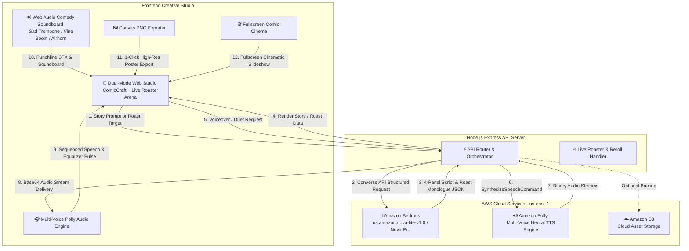

# Weekend Creative Challenge: ComicCraft AI & Live Roaster Arena

**Tag:** `#creative-expression`

---

## 🌟 Vision & What the App Does

Creativity is at its best when it connects with people through humor, storytelling, and play. For the **AWS Weekend Creative Challenge**, we built **ComicCraft AI & Live Roaster Arena**—a dual-mode generative creative powerhouse that turns everyday thoughts, bugs, and embarrassing tech disasters into **voiced 4-panel comic strips** and **savage standup AI roasts**.

The app encompasses two complete, interconnected creative studios:

### 1. 💥 Comic Storyboard Studio
Users provide any premise (or choose an inspiration spark), and **Amazon Bedrock (Nova Lite/Pro)** drafts a complete 4-panel narrative (Setup, Escalation, Climax, and Punchline) with character dialogue banter, scene descriptions, and classic sound effect stickers (*POW!*, *KABOOM!*, *404 ERROR!*).

### 2. 🔥 Live AI Roaster Arena
Users describe themselves, a friend, a coding catastrophe, or an over-engineered habit (e.g. *"I spent 4 days configuring Kubernetes on AWS just to host a static HTML resume with 3 visitors"*). 
The AI Roaster immediately:
- Calculates an animated **"EMOTIONAL DAMAGE 💀 (10/10)"** Burn Meter.
- Writes a savage 3-paragraph spoken comedy monologue + tweetable punchline one-liner.
- Generates an accompanying **4-panel Roast Comic Strip** visually illustrating the disaster!
- Delivers voice acting through **Amazon Polly Neural TTS** with comedy sound effects (*Sad Trombone, Vine Boom, Airhorn, Laugh Track*).

---

## 🎭 The 4 Creative Challenge Pillars

1. **Words (Narrative & Standup Comedy):** Powered by **Amazon Bedrock (Amazon Nova Lite & Pro)** with structured JSON schemas via the `Converse API`.
2. **Images (Pop-Art Comics & Roast Cards):** Generates retro halftone panels, dynamic visual gradients, generative SVG themes, and downloadable quote cards.
3. **Sound (Multi-Voice Duets & Web Audio Soundboard):** Powered by **Amazon Polly Neural TTS** (*Ruth, Matthew, Stephen, Arthur, Joanna*) with character duets, combined with an in-browser Web Audio synthesizer for punchline stingers (*Sad Trombone, Vine Boom, Airhorn*).
4. **Play (Live Roaster, Cinema Mode, & Direct Editing):** Users can edit dialogue bubbles, reroll individual comic panels, stamp interactive sound stickers, and enjoy full-screen slideshow presentations in **Cinema View**.

---

## 🏗️ Architecture & AWS Services



### AWS Services Breakdown:
- **Amazon Bedrock (Amazon Nova Lite & Pro):** Crafts witty comic narratives, character dialogues, and standup comedy roasts via the unified `Converse API`.
- **Amazon Polly (Multi-Voice Neural TTS):** Powers voice acting across multiple personas (*Ruth, Matthew, Stephen, Arthur*) for comic banter and spoken roasts.
- **Amazon Simple Storage Service (Amazon S3):** Provides scalable cloud storage for backing up generated comics and visual assets.

---

## 🛠️ How We Built It

### 1. Dual Creative Prompt Engineering with Amazon Nova
We constructed two specialized system prompts for Bedrock:
- **ComicCraft Story Prompt:** Enforces strict 4-panel narrative progression, character dialogue pairs, and visual color scheme tokens.
- **Roast Master Prompt:** Generates comedic timing, burn level ratings, tweetable one-liners, and an accompanying 4-panel cartoon storyboard depicting the user's disaster.

### 2. Multi-Character Duet & Roast Voice Delivery
Amazon Bedrock tags speakers and emotions, which the backend routes to Amazon Polly:
```javascript
const command = new SynthesizeSpeechCommand({
  OutputFormat: "mp3",
  Text: roastText,
  VoiceId: voiceId || "Matthew",
  Engine: "neural"
});
const pollyRes = await pollyClient.send(command);
```
On the client, audio streams are chained sequentially while illuminating the active speech bubbles and triggering Web Audio comedy stingers (*Sad Trombone, Vine Boom*).

### 3. Interactive Play & Comedy Soundboard
- Users can switch between **Comic Studio** and **Live AI Roaster** with one click.
- Real-time Web Audio synthesizer generates instant comedy soundboard effects.
- Single-panel **"🔄 Reroll"** allows regenerating punchlines without losing the comic.
- 1-click **"Export PNG"** captures high-resolution, printable comic strips and roast cards.

---

## 💡 What We Learned

1. **Amazon Nova’s Comedic Range:** Nova models excel at understanding developer humor, contextual irony, and sharp punchline structure while strictly respecting complex JSON output schemas.
2. **The Power of Multi-Modal Audio & Visual Synthesis:** Blending AI text with real-time neural voices, sound synthesis, and comic art creates a deeply entertaining, shareable experience that captivates audiences.

---

## 🔗 Project Links & Source Code

- **GitHub Repository:** [https://github.com/ianasriaz/AWS-Weekend-Challenge-Build-a-Creative-App](https://github.com/ianasriaz/AWS-Weekend-Challenge-Build-a-Creative-App)
- **Live Demo:** Running locally with AWS Bedrock & Polly in `us-east-1`.

---

*Built with ❤️ for the AWS Builder Center Weekend Creative Challenge (#creative-expression).*
