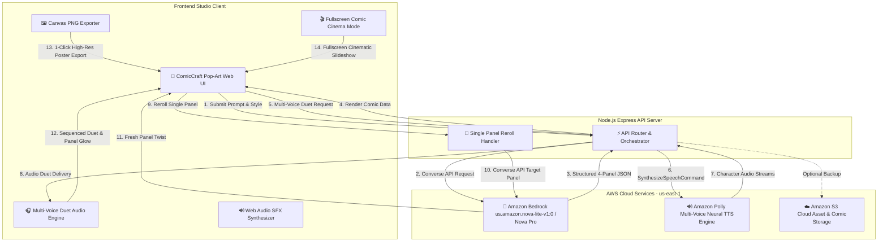

# Weekend Creative Challenge: ComicCraft AI Studio

**Tag:** `#creative-expression`

---

## 🌟 Vision & What the App Does

Creativity is most powerful when it sparks joy, humor, and imagination. Comics have connected audiences across generations through a unique marriage of storytelling, visual punchlines, expressive pacing, and memorable character banter. However, traditional comic creation demands specialized drawing skills, lettering expertise, and extensive manual production.

**ComicCraft AI Studio** is a multi-modal creative web application designed to democratize cartoon storytelling. Built for the **AWS Weekend Creative Challenge**, ComicCraft enables anyone—whether a developer, writer, or creative enthusiast—to transform any quirky idea or premise into a **fully illustrated, multi-voiced, and interactive 4-panel comic strip** in under five seconds.

The application spans all four creative dimensions:
1. **Words (Narrative & Dialogue):** Powered by **Amazon Bedrock** using the **Amazon Nova Lite & Pro** foundation models, the engine writes complete 4-panel narrative structures (Setup, Escalation, Climax/Twist, and Punchline) equipped with snappy dialogues, character personas, emotional cues, narrator captions, and classic comic sound effect tags (*POW!*, *KABOOM!*, *404 ERROR!*).
2. **Images (Visual Comic Strip):** Renders dynamic, pop-art stylized panels with customized color gradients, retro halftone textures, visual scene backdrops, character badge avatars, and distinct speech bubbles.
3. **Sound (Multi-Voice Duets & Web Audio SFX):** Powered by **Amazon Polly Neural Text-to-Speech (TTS)**, the app delivers multi-character voice duets (e.g. *Ruth* as the witty hero and *Matthew* as the sidekick), synthesized comic impact SFX (*POW!*, *KABOOM!*, *BOING!*), and sequential panel audio with synchronized equalizer pulsing.
4. **Play (Interactive Studio, Cinema Mode & Panel Reroll):** Users aren't just passive readers—they can directly edit speech bubble text, stamp sound effect stickers onto panels, reroll individual punchline panels on the fly, launch a full-screen **Comic Cinema** slideshow, and export high-resolution comic posters with a single click.

---

## 🏗️ AWS Services Used & Architecture Overview

ComicCraft AI leverages a modern, serverless-oriented AWS architecture designed for low latency, high throughput, and cost-efficient creative generation:



### AWS Services Breakdown:
- **Amazon Bedrock (Amazon Nova Lite & Pro):** Serves as the creative core via Bedrock’s unified `Converse API`. Using structured system prompting, it enforces strict JSON schemas containing narrative captions, emotional states, scene descriptions, and dialogue pairs. Also powers single-panel rerolling on demand.
- **Amazon Polly (Multi-Voice Neural Engine):** Delivers natural, expressive voice synthesis across multiple voice personas (e.g., *Ruth, Matthew, Joanna, Arthur, Stephen*). Enables multi-voice duets where distinct characters speak in alternating neural voices.
- **Amazon Simple Storage Service (Amazon S3):** Provides scalable cloud storage for backing up generated comic structures and exported graphic assets.

---

## 🛠️ How We Built It

### 1. The Multi-Modal Pipeline
The primary technical goal was ensuring that comic generation felt instantaneous and fluid. We built an Express.js backend utilizing the `@aws-sdk/client-bedrock-runtime` and `@aws-sdk/client-polly` SDKs.

For the narrative generation, we leveraged the **Converse API** on Amazon Nova:
```javascript
const command = new ConverseCommand({
  modelId: "us.amazon.nova-lite-v1:0",
  messages: [{ role: "user", content: [{ text: userPrompt }] }],
  system: [{ text: COMIC_SYSTEM_PROMPT }],
  inferenceConfig: {
    maxTokens: 2500,
    temperature: 0.85,
    topP: 0.9
  }
});
const response = await bedrockClient.send(command);
```

### 2. Multi-Character Neural Voice Duets
Rather than generating a flat, single-voice audio file, we engineered a multi-character voice duet pipeline. Amazon Bedrock tags character gender and suggested voices, allowing Amazon Polly to synthesize distinct neural audio clips for the narrator and individual cartoon characters. When playing the story, the client seamlessly orchestrates the conversation banter while lighting up active speech bubbles.

### 3. Interactive Play & Direct Editing
To fulfill the "Play" dimension of the challenge:
- Speech bubbles use `contenteditable="true"`, allowing users to tweak punchlines or rewrite character lines.
- Single-panel **"🔄 Reroll"** buttons allow creators to ask Amazon Nova for alternative twists and punchlines without rebuilding the entire comic.
- An interactive **Action Sticker Tray** with built-in Web Audio SFX allows users to stamp retro comic sound stickers (*POW!*, *BAM!*, *AWS!*, *KABOOM!*) anywhere on the canvas.
- A **Fullscreen Comic Cinema Mode** enables an animated slideshow presentation with keyboard arrow navigation and automated voice narration.
- An integrated `html2canvas` renderer captures the entire rendered comic grid at `scale: 2` for crisp, printable PNG exports.

### 4. Key Challenges Overcome
- **Multi-Voice Pacing:** Combining distinct Polly audio clips required precise promise queuing in the browser to avoid overlapping dialogue. We resolved this by chaining `HTML5 Audio` events (`onended`) across dynamic character dialogue arrays.
- **Low-Latency Audio Delivery:** Writing MP3 files to local disk before serving added unnecessary I/O overhead. We optimized this by accumulating Polly’s `AudioStream` chunks in memory as a binary `Buffer` and returning a Base64 data URI directly to the browser.

---

## 💡 What We Learned

1. **Amazon Nova’s Speed and Creative Precision:** Testing across `nova-micro`, `nova-lite`, and `nova-pro` demonstrated how effectively Nova models balance comedic timing, structured JSON adherence, and lightning-fast inference times.
2. **Bedrock Converse API Streamlining:** The unified `Converse API` simplifies multi-turn conversations and system prompt injection across diverse model providers, eliminating model-specific payload boilerplate.
3. **Multi-Sensory Immersion:** Combining AI text generation with multi-voice neural acting and interactive visual manipulation elevates an app from a simple text generator into a memorable, joyful multimedia studio.

---

## 🔗 Project Links & Source Code

- **GitHub Repository:** [https://github.com/ianasriaz/AWS-Weekend-Challenge-Build-a-Creative-App](https://github.com/ianasriaz/AWS-Weekend-Challenge-Build-a-Creative-App)
- **Live Demo:** Deployed with AWS Bedrock & Polly in `us-east-1`.

---

*Built with ❤️ for the AWS Builder Center Weekend Creative Challenge (#creative-expression).*
