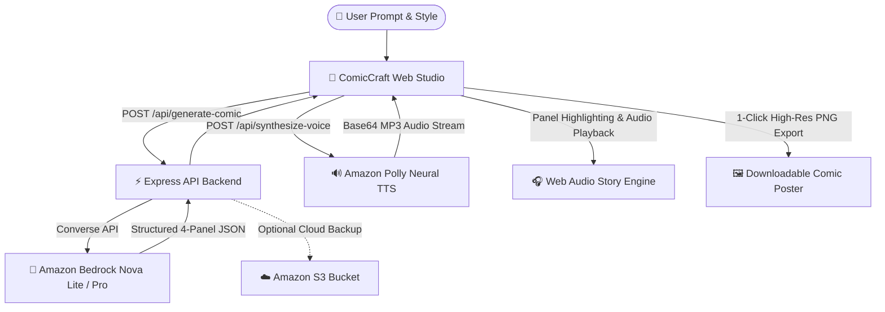

# 💥 ComicCraft AI Studio
> **An Interactive Multi-Modal Comic & Voice Storybook Studio**  
> Built for the **AWS Weekend Challenge: Build a Creative App** (`#creative-expression`)

[](https://aws.amazon.com/bedrock/)
[](https://aws.amazon.com/polly/)
[](https://aws.amazon.com/s3/)
[](https://github.com/ianasriaz/AWS-Weekend-Challenge-Build-a-Creative-App)

---

## 🌟 Overview

**ComicCraft AI Studio** is a creative generative web application that transforms any idea, premise, or spark prompt into a **voiced, 4-panel illustrated comic strip** in seconds.

It unites all 4 creative dimensions:
- 📝 **Words**: Powered by **Amazon Bedrock (Amazon Nova Lite & Pro)**, crafting 4-panel narrative arcs, character dynamics, punchlines, and sound effect cues.
- 🎨 **Images**: Pop-art comic canvas with custom halftones, dynamic scene gradients, and generative SVG graphic themes.
- 🔊 **Sound**: Powered by **Amazon Polly (Neural Engine)**, delivering character-acted voiceovers and narrator pacing synced with visual panel transitions.
- 🎮 **Play**: Interactive Comic Studio featuring real-time speech bubble editing, action sound stickers (*POW!*, *BAM!*, *AWS!*), voice selection, and 1-click high-resolution PNG export.

---

## 🏗️ Architecture



---

## ⚡ Features

1. **Inspiration Sparks**: One-click prompt presets (*Lambda Cold Start*, *Time Traveling Cat*, *Git Rebase in 1350 AD*, *Coffee Maker Rebellion*, *Pigeon Detective*).
2. **Visual Art Styles**: Choose from *Classic 80s Marvel Pop-Art*, *Cyberpunk Neon Noir*, *Shonen Anime Manga*, *3D Animated Toon*, and *16-Bit Retro Pixel*.
3. **Neural Narrators**: Switch between dynamic Amazon Polly voices (*Ruth*, *Matthew*, *Joanna*, *Arthur*, *Stephen*).
4. **Sequenced Audio Player**: Click *"Play Voiced Story"* to experience an automated, voiced comic reading with synchronized panel glow animations.
5. **Direct Bubble Editing**: Click inside any dialogue bubble to tweak jokes or write your own dialogue.
6. **Action Stickers**: Tap sound stickers to stamp them onto any panel.
7. **High-Res Poster Export**: Export the entire 4-panel comic strip with crisp typography directly to PNG.

---

## 🚀 Quick Start

### 1. Prerequisites
- [Node.js](https://nodejs.org/) v18+ installed.
- AWS Account with Bedrock & Polly enabled in `us-east-1`.

### 2. Setup Credentials
Create a `.env` file in the root directory:
```env
AWS_REGION=us-east-1
AWS_ACCESS_KEY_ID=your_access_key_id
AWS_SECRET_ACCESS_KEY=your_secret_access_key
PORT=3000
```

### 3. Install & Run
```bash
npm install
node server.mjs
```

Open your browser at: **`http://localhost:3000`**

---

## 📄 License
MIT License. Built with ❤️ for the AWS Weekend Challenge.
